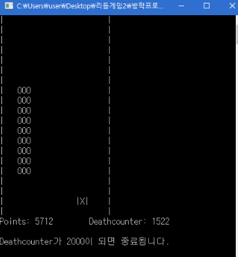

# Mole-catching-versionC

## 프로그램 설명서
- 프로그램을 실행하면 “TOP10.txt”파일 내에 있던 전 플레이어 상위 10명의 기록이 프로그램 내 구조체에 저장된다.  
- 바로 게임이 시작된다. (게임 룰은 하단에 설명)  
- 게임이 끝나면 이름을 입력한다.  
- 만일 자신의 점수가 TOP10내에 들어간다면 TOP10에 기록 및 정렬한다. 아닐 수 top10에 들지 않았다며 공손하게 알려준다.  
- 이름 입력 후 플레이어는 두가지 검색을 할 수 있다. 첫째는 top10플레이어 이름 검색이고 둘째는 top 순위 별 점수 검색이다. 이 검색은 계속 할 수 있으며 검색을 종료하고 싶을 시 1, 2 외에 다른 숫자를 입력하면 된다.  

## 게임 룰
- 이 게임은 피하기 게임이 아닙니다. 날아오는 막대형 먹이를 먹어야 합니다.  
- 만일 막대기 먹이 첫 부분을 먹지 못할 경우 중간부터 먹기가 불가능합니다. 즉 막대기 먹이 하나 점수를 얻지 못합니다.  
- 이 게임은 일정거리에 도달하면 자동 종료됩니다.  

## 화면 모습 
  
게임의 모습

  
점수 저장 시 모습